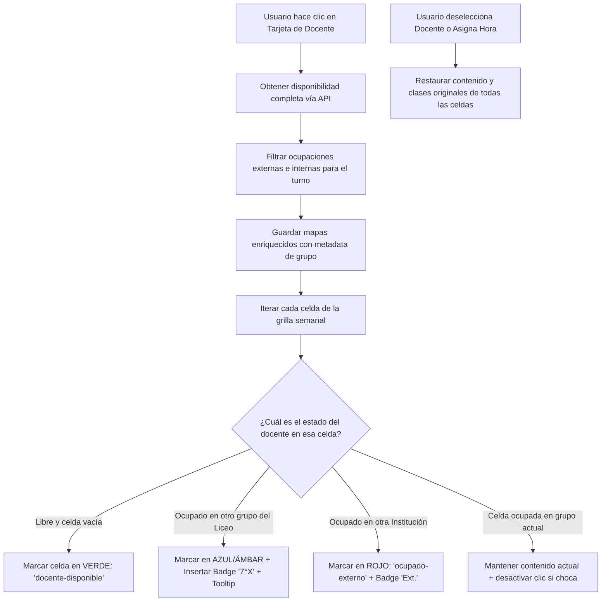

# 📋 Plan de Acción: Diferenciación de Ocupación Docente en la Grilla de "Armar Horarios"

> **Documento de especificación y diseño técnico**  
> **Módulo afectado:** `modulos/armado.js` (Armar Horarios)  
> **Estilos afectados:** `css/horario.css`  
> **Backend relacionado:** `server/routes/disponibilidad.js`  
> **Fecha:** Septiembre 2026  
> **Estado:** 📝 Planificado / Listo para revisión

---

## 1. 🎯 Objetivo de la Funcionalidad

Actualmente, cuando el usuario selecciona un docente en el panel lateral de **"Armar Horarios"** (`modulos/armado.js`), la grilla semanal resalta:
- En **verde** (`.docente-disponible`): las celdas en las que el docente tiene disponibilidad libre.
- En **rojo** (`.ocupado-externo`): las celdas en las que el docente está ocupado.

### El problema actual:
El sistema marca como "ocupado" de forma genérica tanto si el docente está dando clase en **otra institución** como si está dando clase en **otro grupo del mismo liceo** (por ejemplo, si estamos armando el horario de `7°4` y el docente ya tiene clase asignada en `7°1`, `7°2` o `7°3`). El usuario no puede saber a simple vista **por qué** está ocupado ni **en qué grupo** está dictando clase.

### La solución requerida:
Al seleccionar un docente en la pantalla de armado de horario:
1. **Diferenciar visualmente** si la ocupación es **Externa** (otra institución) o **Interna** (otro grupo del liceo).
2. **Mostrar explícitamente en la celda** el nombre del grupo causante de la ocupación interna (ej. `7°1`, `7°2`, `8°3`), junto con la materia si corresponde en tooltip/detalle.
3. **Mantener la integridad de la grilla**, de modo que al deseleccionar al docente o asignar la hora, la celda vuelva a su estado normal de forma limpia y reactiva.

---

## 2. 🔍 Diagnóstico y Estado Actual del Código

### 2.1 Backend (`server/routes/disponibilidad.js`)
El endpoint `GET /api/disponibilidad/completa_docente/:id_docente` **ya devuelve** la información necesaria en dos arreglos:
- `externos`: Celdas con ocupación en otras instituciones (`dd.dia_semana`, `dd.numero_hora`, `dd.id_turno`).
- `internos`: Celdas con clases ya asignadas en el liceo, incluyendo:
  - `hg.dia_semana`, `hg.numero_hora`
  - `g.id_turno`
  - `hg.id_grupo`
  - `CONCAT(n.nombre, g.numero) AS grupo_nombre` (ej. `"7°1"`, `"8°2"`, `"EMS1"`)
  - `a.nombre AS asignatura_nombre`

> **Conclusión Backend:** La API ya provee todos los datos. No se requieren cambios estructurales obligatorios en la base de datos ni nuevas rutas en la API, aunque se puede optimizar el payload si fuera necesario.

### 2.2 Frontend (`modulos/armado.js`)
- En `_cargarDisponibilidadDocente()`:
  - Guarda `_docenteOcupacionExterna` como `{ "dia:hora": true }`.
  - Guarda `_docenteOcupacionInterna` como `{ "dia:hora": true }` (descartando `grupo_nombre` y `asignatura_nombre`).
- En `_resaltarCeldasDisponibles()`:
  - Aplica indiscriminadamente `celda.classList.add('ocupado-externo')` tanto si es externo como interno.
  - No altera el contenido visual (HTML) de la celda para mostrar la etiqueta del grupo.
- En `_deseleccionarDocente()`:
  - Solo limpia clases CSS de selección, pero no restaura contenido textual previo si se insertaran elementos dinámicos.

### 2.3 Estilos CSS (`css/horario.css`)
- `.celda-horario.docente-disponible .celda-inner`: Fondo verde traslúcido y borde verde.
- `.celda-horario.ocupado-externo .celda-inner`: Fondo rojo traslúcido genérico.
- Falta definir clases y componentes visuales para:
  - `.celda-horario.ocupado-interno` (resaltado con información de grupo).
  - `.badge-ocupacion-docente` (badge compacto que muestra el grupo `7°1`, `8°2`, etc.).
  - `.badge-ocupacion-externa` (badge o indicador compacto para "Otra Inst.").

---

## 3. 📐 Diseño de la Solución Propuesta

### 3.1 Estados Visuales de las Celdas al Seleccionar Docente

| Tipo de Celda | Color / Estilo | Contenido Visible en Celda | Tooltip (`title`) |
| :--- | :--- | :--- | :--- |
| **Disponible** | 🟢 Verde (`#22c55e`) | Icono `+` o vacío resaltado | `"Disponible para asignar"` |
| **Ocupado en Otro Grupo** (Interno) | 🔵 Azul / Violeta Liceo o 🟠 Ámbar con Badge | Badge con Grupo: **`7°1`** o **`7°2`** + icono liceo | `"Ocupado en el liceo: Grupo 7°1 (Matemática)"` |
| **Ocupado en Otra Institución** (Externo) | 🔴 Rojo (`#ef4444`) | Badge o texto: **`Ext.`** / Icono edificio | `"Ocupado en otra institución"` |
| **Celda ya ocupada en el grupo actual** | Estado propio del grupo actual | Asignatura y docente del grupo actual | Detalle de la clase en el grupo actual |

### 3.2 Diagrama de Flujo de Interacción



---

## 4. 🛠️ Plan Detallado de Implementación Paso a Paso

### Paso 1: Estructura de Datos en `modulos/armado.js`
Modificar `_cargarDisponibilidadDocente()` para conservar la información del grupo y asignatura:
```javascript
// Estructura enriquecida:
_docenteOcupacionInterna = {
  "1:2": { 
    grupo_nombre: "7°1", 
    asignatura_nombre: "Matemática", 
    id_grupo: 3 
  }
};

_docenteOcupacionExterna = {
  "2:4": { 
    tipo: "externo", 
    descripcion: "Otra institución" 
  }
};
```

### Paso 2: Mecanismo de Renderizado / Resaltado Reactivo
Para evitar perder el contenido original de las celdas del grupo actual:
1. Almacenar o reconstruir limpiamente el estado de la celda al entrar y salir del modo "Docente Seleccionado".
2. En `_resaltarCeldasDisponibles()`:
   - Identificar si la celda del grupo actual ya contiene una materia asignada (en `_horarioGrupo`).
   - Si la celda está vacía en este grupo:
     - **Si tiene ocupación interna (otro grupo):**
       - Agregar clase `.ocupado-interno` al contenedor de la celda.
       - Renderizar dentro de `.celda-inner`:
         ```html
         <div class="celda-ocupacion-docente ocupacion-interna">
           <span class="badge-grupo-ocupado">
             <i class="fa-solid fa-school"></i> 7°1
           </span>
           <span class="subtexto-ocupado">Clase Liceo</span>
         </div>
         ```
       - Configurar `title="Ocupado en el liceo: Grupo 7°1 (Matemática)"`.
     - **Si tiene ocupación externa (otra institución):**
       - Agregar clase `.ocupado-externo`.
       - Renderizar dentro de `.celda-inner`:
         ```html
         <div class="celda-ocupacion-docente ocupacion-externa">
           <span class="badge-grupo-ocupado">
             <i class="fa-solid fa-building"></i> Ext.
           </span>
           <span class="subtexto-ocupado">Otra inst.</span>
         </div>
         ```
       - Configurar `title="Ocupado en otra institución"`.
     - **Si está disponible:**
       - Agregar clase `.docente-disponible`.
       - Renderizar icono `+` o indicar `"Libre"`.
       - Configurar `title="Disponible para asignar"`.

### Paso 3: Función de Restauración al Deseleccionar
En `_deseleccionarDocente()` y al completar una asignación:
- Re-ejecutar `_actualizarInterfaz()` o `_restaurarContenidoGrilla()` para repintar las celdas en base exclusivamente al `_horarioGrupo` del grupo actual, eliminando todos los badges de ocupación temporal.

### Paso 4: Actualización de Estilos en `css/horario.css`
Añadir las reglas CSS necesarias con diseño pulido y acorde al tema glassmorphism oscuro:
- `.celda-horario.ocupado-interno .celda-inner`: Fondo con matiz azul traslúcido (`rgba(59, 130, 246, 0.18)`), borde `rgba(59, 130, 246, 0.4)`.
- `.badge-grupo-ocupado`: Píldora con tipografía destacada (Inter 700), tamaño de fuente `0.72rem`, contraste nítido y micro-icono.
- `.subtexto-ocupado`: Texto secundario `0.58rem` en gris claro (`var(--text-muted)`).
- Animación suave de transición (`transition: all 0.2s ease`).

### Paso 5: Actualización de la Leyenda de la Grilla
En `_renderizarLeyenda()` de `modulos/armado.js`:
- Añadir a la leyenda inferior los nuevos estados para que el usuario siempre tenga referencia:
  - 🟢 **Disponible** (Docente seleccionado)
  - 🔵 **Clase en otro grupo** (Ej. 7°1, 7°2)
  - 🔴 **Otra institución** (Externo)
  - 🟣 **Asignada en este grupo**

---

## 5. ⚠️ Consideraciones de Casos Borde

1. **Docente que dicta en múltiples grupos en la misma franja (error o choque previo):**
   - El sistema debe soportar concatenar o priorizar el primer grupo conflictivo encontrado.
2. **Celdas que ya tienen una materia asignada en el grupo actual:**
   - Si `7°4` ya tiene asignada `Historia` en el Lunes hora 1, y seleccionamos al profesor de `Matemática` que da clase en `7°1` a esa misma hora:
   - La celda debe seguir mostrando la asignación de `Historia` de `7°4`, pero mostrar una advertencia o borde sutil indicando que el profesor de Matemática no podría cambiarse ahí por choque.
3. **Persistencia y Reactividad:**
   - Al asignar una hora, la disponibilidad interna de ese docente se actualiza de inmediato para subsiguientes asignaciones sin recargar la página.

---

## 6. 🧪 Plan de Pruebas y Validación

| Caso de Prueba | Escenario | Resultado Esperado |
| :--- | :--- | :--- |
| **CP-01** | Seleccionar docente con horas asignadas en `7°1` y armar `7°4`. | En las horas donde dicta en `7°1`, la celda muestra badge azul `7°1` y tooltip `"Ocupado en el liceo: Grupo 7°1 (Materia)"`. |
| **CP-02** | Seleccionar docente con disponibilidad externa (otra institución). | En esas horas la celda se pinta en rojo con badge `Ext.` y tooltip `"Ocupado en otra institución"`. |
| **CP-03** | Seleccionar docente con horas libres. | Las celdas libres se muestran en verde brillante listas para asignar. |
| **CP-04** | Clic en celda marcada con `7°1` o `Ext.` | El sistema bloquea el clic y muestra toast de advertencia descriptivo (`"El docente ya está asignado en el grupo 7°1 en este horario"`). |
| **CP-05** | Deseleccionar al docente (clic de nuevo en su tarjeta). | La grilla vuelve a su estado original mostrando únicamente las materias de `7°4` y celdas vacías limpias. |
| **CP-06** | Asignar exitosamente una materia. | La nueva hora se guarda en PostgreSQL, la grilla se actualiza y los contadores se recalculan. |

---

## 7. 📁 Resumen de Archivos a Modificar en la Ejecución Futura

1. `modulos/armado.js`:
   - Enriquecer `_cargarDisponibilidadDocente()`.
   - Modificar `_resaltarCeldasDisponibles()` y `_deseleccionarDocente()`.
   - Modificar `_renderizarLeyenda()`.
   - Mejorar mensajes de `_verificarConflictoExterno()`.
2. `css/horario.css`:
   - Añadir estilos para `.celda-horario.ocupado-interno`, `.badge-grupo-ocupado`, `.subtexto-ocupado`.
3. `TAREAS.md`:
   - Registrar la nueva funcionalidad bajo la Fase 7.3.
